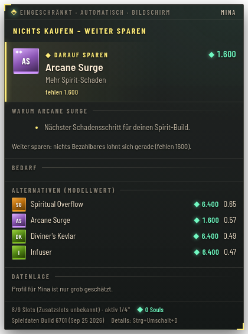
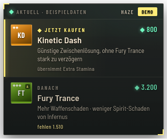
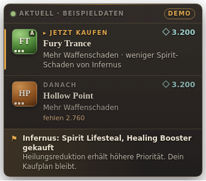
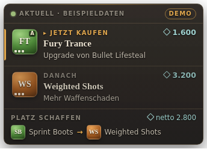
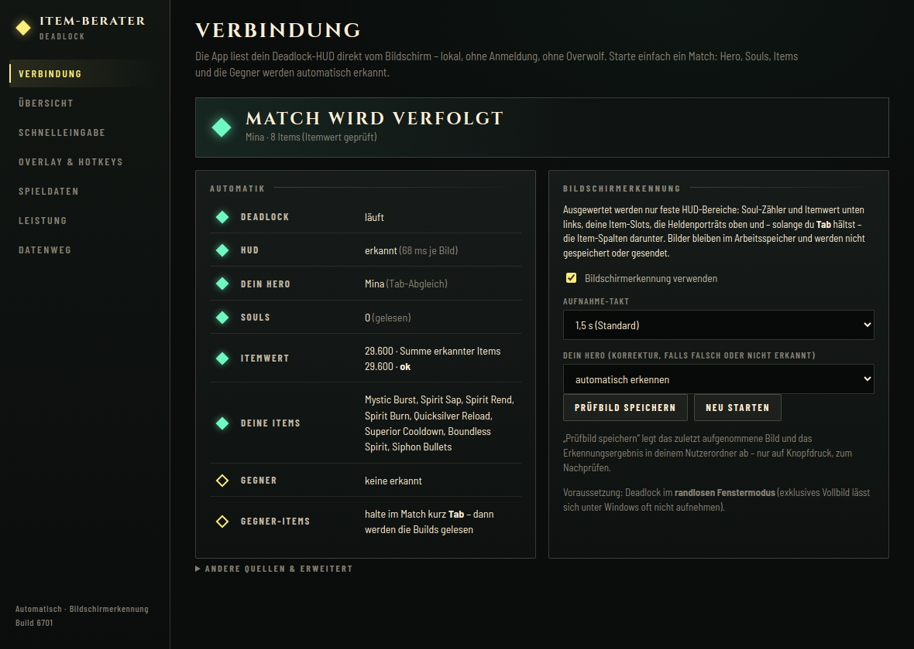

# Deadlock Item-Assistent

Windows-Desktop-App mit einem kleinen Ingame-Overlay für **Deadlock**. Die App empfiehlt, welches Item du als Nächstes kaufen solltest, und begründet das. Grundlage sind dein Hero, dein aktueller Build, dein Budget und die gegnerischen Heroes und Items.

- **Jetzt kaufen / darauf sparen**, mit Preis nach Komponentenrabatt, fehlendem Betrag und einer ausdrücklichen Abwägung.
- **Kurze Begründung** je Empfehlung, abgeleitet aus denselben Faktoren wie die Auswahl.
- **Dezente Hinweise** bei entscheidenden gegnerischen Käufen: gebündelt, ohne Duplikate, ohne Ton und ohne Fokuswechsel.
- **Austauschvorschlag** bei vollem Inventar: Netto-Kosten, Gewinn und Verlust. Das Item geht nie reflexhaft an das billigste.

## Vollautomatisch – per Bildschirmerkennung

Einfach Deadlock starten: Die App liest dein HUD direkt vom Bildschirm und verfolgt **jedes Match automatisch**. Keine Anmeldung, kein Overwolf, kein Schlüssel und pro Match keine Eingabe.

| Was | Woher auf dem Bildschirm | Wie |
|---|---|---|
| Deine Souls (Budget) | Soul-Zähler unten links | Texterkennung (tesseract.js, lokal) |
| Deine Items | die 12 Item-Slots darunter | Vergleich mit Fingerabdrücken der offiziellen Icons; Kategorie aus der Farbe des Stufen-Abzeichens |
| Gegenprobe | „$N ITEM VALUE“ | muss der Summe der Listenpreise der erkannten Items entsprechen |
| Dein Hero und die Gegner | Heldenporträts oben | Vergleich mit den offiziellen Heldenbildern; bei mehreren Porträts entscheidet die Tab-Spalte, deren Items zu deinem HUD passen |
| Builds der Gegner | Item-Spalten unter den Porträts, **solange du Tab hältst** | wie oben; die gelesenen Items bleiben bis zum nächsten Tab gültig |
| Neues Match | Hero-Wechsel, Itemwert fällt auf einen Bruchteil, andere Gegner | automatischer Reset |

- **Datenschutz:** Ausgewertet werden nur diese Bereiche, und nur während Deadlock läuft. Bilder bleiben im Arbeitsspeicher; gespeichert wird nur auf Knopfdruck („Prüfbild speichern“).
- **Korrektur:** Wird dein Hero nicht erkannt, kannst du ihn unter *Verbindung* auswählen. Unsichere Slots zählen als „nicht erkannt“ und nie als falsches Item.
- **Auflösungen:** Alle Maße skalieren mit dem Soul-Kreis. Geprüft mit 720p, 900p, 1080p, 1440p und 4K (skaliert aus echten Screenshots).

**Overwolf** gibt seine Spielevents nur für Apps frei, die Overwolf selbst genehmigt; private Tools werden nicht genehmigt. Der Code dafür ist noch vorhanden, bleibt ohne Freigabe aber inaktiv. Die frühere Anleitung „eigenen Overwolf-Schlüssel anlegen“ war falsch und ist entfernt.

> **Ehrlicher Stand:** siehe [`docs/STATUS.md`](docs/STATUS.md). Die Erkennung ist an deinen echten Screenshots geprüft (Sandbox, 1 Hero). **Ein echtes 6-gegen-6-Match stand noch nicht zur Verfügung**: Lage der 12 Porträts, Tab-Spalten der Gegner und größere Soul-Zahlen sind noch nicht an echten Bildern bestätigt.

| Bildschirmerkennung (Mina, echter Screenshot) | Kompakt | Hinweis bei Gegnerkauf | Austausch bei vollem Inventar |
|---|---|---|---|
|  |  |  |  |



Das Design folgt Deadlocks eigener Farbwelt (Werte aus den Panorama-Styles des Spiels):

- fast schwarze, grünlich getönte Flächen
- Elfenbeintext `#FFEFD7`
- Gold `#FFED79` für die Empfehlung
- Mintgrün `#70F8C1` für Souls
- Feindrot `#FF410D` für Hinweise
- Shop-Kategoriefarben: Waffe orange, Vitalität grün, Spirit violett

Die Screenshots zeigen die echte Oberfläche, aufgenommen unter Linux/Xvfb. Bei der Bildschirmerkennung diente einer deiner Screenshots als Bildschirmbild, sonst der Demo-Modus.

## Voraussetzungen

- **Nutzung:** Windows 10/11 (x64); Deadlock im **randlosen Fenstermodus**. Exklusiver Vollbildmodus ist nicht verifiziert.
- **Falls Deadlock als Administrator läuft:** die App ebenfalls als Administrator starten.
- **Entwicklung:** Node.js 22 und npm.

## Installation / Start

**Fertige Version:** Unter *Releases* (Tag `dia-v<version>`):

- `Deadlock-Item-Assistent-Setup-*.exe`: Installer
- `Deadlock-Item-Assistent-*-portable.exe`: ohne Installation

Nicht signiert, deshalb kann SmartScreen warnen.

**Aus dem Quellcode:**

```bash
cd deadlock-item-assistant
npm ci
npm start            # baut und startet (Quelle aus den Einstellungen)
npm run start:demo   # startet mit Demo-Daten
npm test             # 56 Tests, u. a. Bildschirmerkennung an echten Screenshots
npm run typecheck
npm run demo         # Terminal-Demo ohne Oberfläche
npm run dist:win     # Windows-Installer und portable EXE (unter Windows; unter Linux siehe unten)
```

**Spieldaten aktualisieren** (nach einem Patch): in der App unter *Spieldaten → Spieldaten aktualisieren*, oder per Kommandozeile:

```bash
npm run gamedata:fetch && npm run gamedata:extract
```

**Referenzen der Bildschirmerkennung** nach einem Patch neu erzeugen (lädt die offiziellen Icons, speichert nur Fingerabdrücke):

```bash
npm run vision:refs
```

**Daten-Prototyp** gegen ein echtes Match:

```bash
npm run probe -- --base http://localhost:3000 --match <ID> --account <SteamID3> --minutes 10
```

## Bedienung

| Hotkey (änderbar) | Wirkung |
|---|---|
| `Strg+Umschalt+D` | Details öffnen/schließen: Gründe, Gegner, Bedarf, Alternativen, letzte Hinweise |
| `Strg+Umschalt+E` | Bearbeitungsmodus: verschieben, Größe, Deckkraft; derselbe Hotkey oder „Fertig“ beendet ihn |
| `Strg+Umschalt+O` | Overlay ein-/ausblenden |
| `Strg+Umschalt+K` | Einstellungsfenster |

Im normalen Modus reicht das Overlay alle Mausaktionen an das Spiel durch und nimmt keinen Fokus. Die Position wird relativ zum Monitor gespeichert, damit sie DPI- und Auflösungswechsel übersteht.

## Architektur und Stack

**Stack: Electron + TypeScript.** Die Gründe:

- **Datenzugang:** HTTP/SSE im Hauptprozess.
- **Overlay:** transparentes, klickdurchlässiges Fenster über `setIgnoreMouseEvents(…, {forward:true})`, ohne Injektion.
- **Hotkeys:** globale Hotkeys.
- **Pflege:** Eine Codebasis für Logik, Tests und UI. Das Muster ist identisch zum `lol-build-assistant` in diesem Repository.
- **Kein zusätzlicher Client:** kein Overwolf, keine Pflicht-Monetarisierung.
- **Bildschirmaufnahme:** `desktopCapturer` im Hauptprozess; Auswertung in reinem TypeScript, Zahlen mit tesseract.js (WebAssembly, lokal).

```
src/gamedata   KV3-Parser, Extraktion aus Spieldateien, Katalog, Effekte, Hero-Signale, Namensabgleich
src/vision     Bildschirmerkennung: Anker, Item-Slots, Porträts, Tab-Spalten, Texterkennung, Tracker
src/providers  auto | screen | demo | manual | spectator | gep – liefern nur normalisierte Snapshots
src/state      MatchStore: Match-Reset, Rücksprungschutz, Basislinie, bestätigtes Entfernen, Upgrades
src/engine     Bedrohung, Bedarf, gemeinsamer Nutzen, Kaufen/Sparen, Austausch, Stabilisierung, Hinweise, Texte
src/present    ViewModel (nur Aufbereitung)
src/main       Electron-Hauptprozess, Controller, Einstellungen
src/renderer   Overlay, Einstellungs-/Diagnosefenster
data/gamedata  extrahierte Spieldaten (Build 6701)   data/knowledge  kuratierte, build-gebundene Einschätzungen
data/vision    Icon-/Porträt-Fingerabdrücke (refs.json) und deren Quellen
```

Details zur Logik stehen in [`docs/ENGINE.md`](docs/ENGINE.md).

## Grenzen

- Die App liest keinen Speicher, injiziert nichts und sendet keine Eingaben ans Spiel. Sie sieht nur, was auf deinem Bildschirm sichtbar ist – nichts Verdecktes.
- Das ist **keine** Freigabe durch Valve und keine Garantie gegen Sanktionen.
- Kaufe und verkaufe immer selbst; die App berät nur.
- Modellwerte sind keine Siegchancen.
