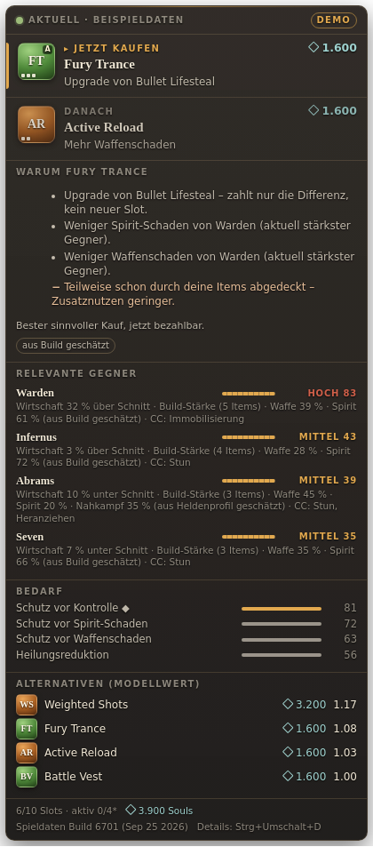

# Deadlock Item-Assistent

Windows-Desktop-App mit einem kleinen Ingame-Overlay für **Deadlock**. Die App empfiehlt, welches Item du als Nächstes kaufen solltest, und begründet das. Grundlage sind dein Hero, dein aktueller Build, dein Budget und die gegnerischen Heroes und Items.

- **Jetzt kaufen / darauf sparen**, mit Preis nach Komponentenrabatt, fehlendem Betrag und einer ausdrücklichen Abwägung.
- **Kurze Begründung** je Empfehlung, abgeleitet aus denselben Faktoren wie die Auswahl.
- **Dezente Hinweise** bei entscheidenden gegnerischen Käufen: gebündelt, ohne Duplikate, ohne Ton und ohne Fokuswechsel.
- **Austauschvorschlag** bei vollem Inventar: Netto-Kosten, Gewinn und Verlust. Das Item geht nie reflexhaft an das billigste.

> **Ehrlicher Stand:** siehe [`docs/STATUS.md`](docs/STATUS.md). Eine automatische Live-Anbindung mit *ausgebbarem* Budget gibt es über keine für ein privates Tool zulässige Quelle ([`docs/DATENWEG.md`](docs/DATENWEG.md)). Die App bietet deshalb drei klar getrennte Quellen:
> **Spectator-Stream** (verzögert, im echten Match ungetestet), **Schnelleingabe** und **Demo** (Beispieldaten).

| Kompakt | Hinweis bei Gegnerkauf | Austausch bei vollem Inventar | Details (Strg+Umschalt+D) |
|---|---|---|---|
|  |  |  |  |

Die Screenshots zeigen die echte Oberfläche im **Demo-Modus** (Beispieldaten), aufgenommen unter Linux/Xvfb. Das Einstellungsfenster zeigt dieselbe Darstellung vor hellen und dunklen Szenen: [`docs/screenshots/control-overview.png`](docs/screenshots/control-overview.png).

## Voraussetzungen

- **Nutzung:** Windows 10/11 (x64); Deadlock im **randlosen Fenstermodus**. Exklusiver Vollbildmodus ist nicht verifiziert.
- **Spectator-Stream (optional):**
  - Docker Desktop mit dem quelloffenen Live-Events-Dienst: `docker run -p 3000:3000 ghcr.io/deadlock-api/deadlock-live-events:latest`
  - die Match-ID
  - deine SteamID3 (Account-ID als Zahl)
- **Entwicklung:** Node.js 22 und npm.

## Installation / Start

**Fertige Version:** Unter *Releases* (Tag `dia-v<version>`) die Datei `Deadlock-Item-Assistent-Setup-*.exe` (Installer) oder `…-portable.exe` herunterladen. Die EXE ist nicht signiert, deshalb kann SmartScreen warnen.

**Aus dem Quellcode:**

```bash
cd deadlock-item-assistant
npm ci
npm start            # baut und startet (Quelle aus den Einstellungen)
npm run start:demo   # startet mit Demo-Daten
npm test             # 37 Tests
npm run typecheck
npm run demo         # Terminal-Demo ohne Oberfläche
npm run dist:win     # Windows-Installer und portable EXE (unter Windows; unter Linux siehe unten)
```

**Spieldaten aktualisieren** (nach einem Patch): in der App unter *Spieldaten → Spieldaten aktualisieren*, oder per Kommandozeile:

```bash
npm run gamedata:fetch && npm run gamedata:extract
```

**Daten-Prototyp** gegen ein echtes Match:

```bash
npm run probe -- --base http://localhost:3000 --match <ID> --account <SteamID3> --minutes 10
```

## Bedienung

| Hotkey (änderbar) | Wirkung |
|---|---|
| `Strg+Umschalt+D` | Details öffnen/schließen: Gründe, Gegner, Bedarf, Alternativen, letzte Hinweise |
| `Strg+Umschalt+E` | Bearbeitungsmodus: verschieben, Größe, Deckkraft; derselbe Hotkey oder „Fertig“ beendet ihn |
| `Strg+Umschalt+O` | Overlay ein-/ausblenden |
| `Strg+Umschalt+K` | Einstellungsfenster |

Im normalen Modus reicht das Overlay alle Mausaktionen an das Spiel durch und nimmt keinen Fokus. Die Position wird relativ zum Monitor gespeichert, damit sie DPI- und Auflösungswechsel übersteht.

## Architektur und Stack

**Stack: Electron + TypeScript.** Die Gründe:

- **Datenzugang:** HTTP/SSE im Hauptprozess.
- **Overlay:** transparentes, klickdurchlässiges Fenster über `setIgnoreMouseEvents(…, {forward:true})`, ohne Injektion.
- **Hotkeys:** globale Hotkeys.
- **Pflege:** Eine Codebasis für Logik, Tests und UI. Das Muster ist identisch zum `lol-build-assistant` in diesem Repository.
- **Kein zusätzlicher Client:** kein Overwolf, keine Pflicht-Monetarisierung.

```
src/gamedata   KV3-Parser, Extraktion aus Spieldateien, Katalog, Effekte, Hero-Signale, Namensabgleich
src/providers  demo | manual | spectator (SSE) – liefern nur normalisierte Snapshots
src/state      MatchStore: Match-Reset, Rücksprungschutz, Basislinie, bestätigtes Entfernen, Upgrades
src/engine     Bedrohung, Bedarf, gemeinsamer Nutzen, Kaufen/Sparen, Austausch, Stabilisierung, Hinweise, Texte
src/present    ViewModel (nur Aufbereitung)
src/main       Electron-Hauptprozess, Controller, Einstellungen
src/renderer   Overlay, Einstellungs-/Diagnosefenster
data/gamedata  extrahierte Spieldaten (Build 6701)   data/knowledge  kuratierte, build-gebundene Einschätzungen
```

Details zur Logik stehen in [`docs/ENGINE.md`](docs/ENGINE.md).

## Grenzen

- Die App liest keinen Speicher, injiziert nichts und sendet keine Eingaben ans Spiel. Lokal liest sie nur die Versionsdatei `steam.inf`.
- Das ist **keine** Freigabe durch Valve und keine Garantie gegen Sanktionen.
- Kaufe und verkaufe immer selbst; die App berät nur.
- Modellwerte sind keine Siegchancen.
