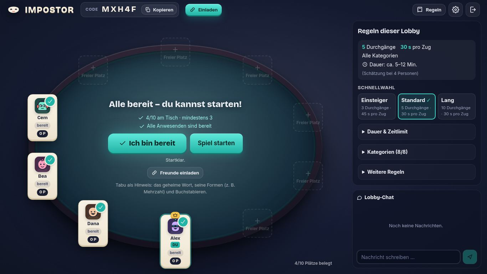
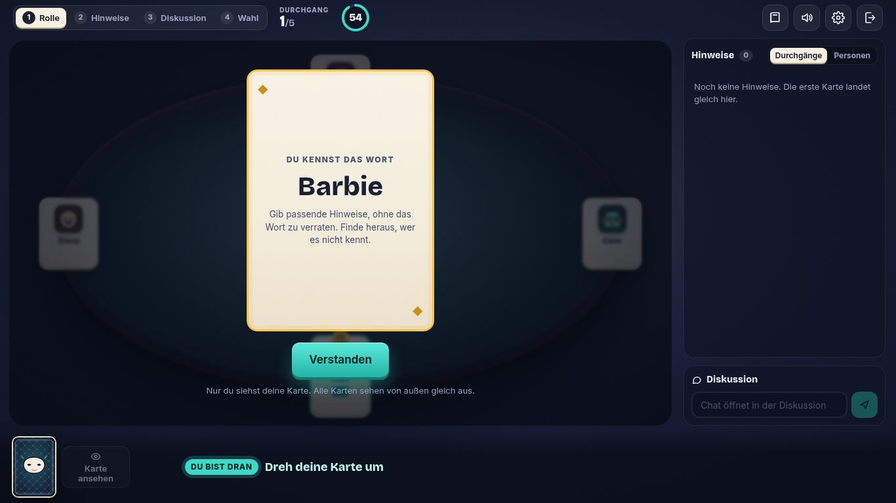
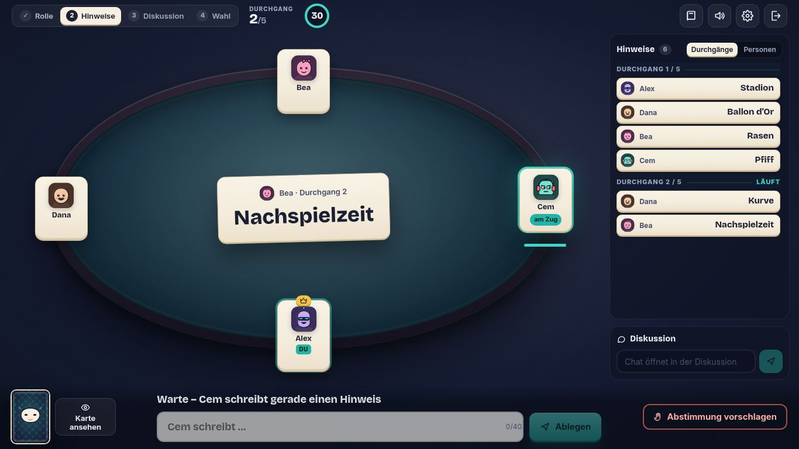
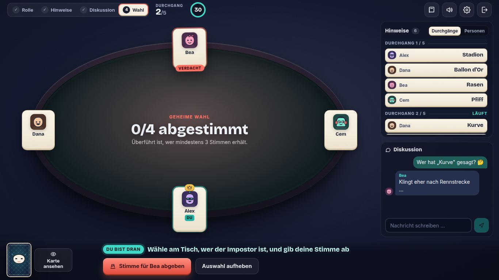
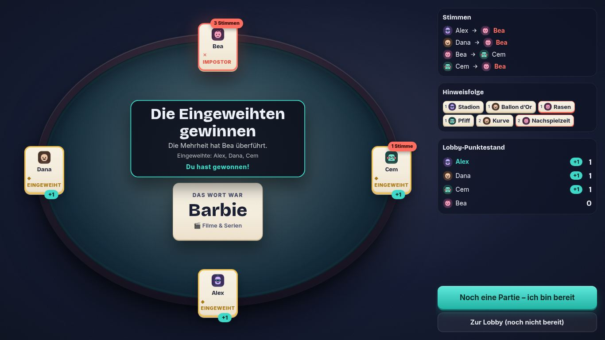
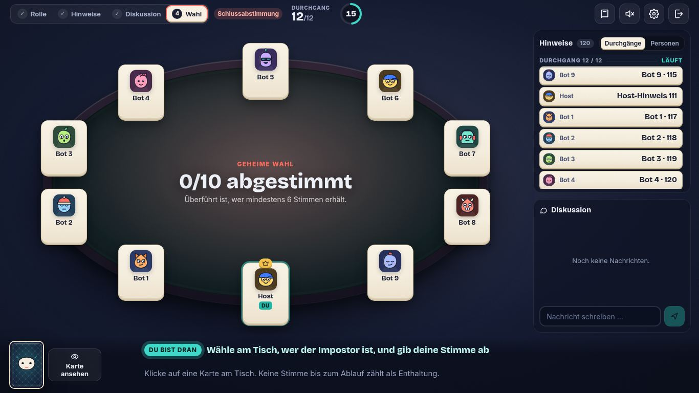
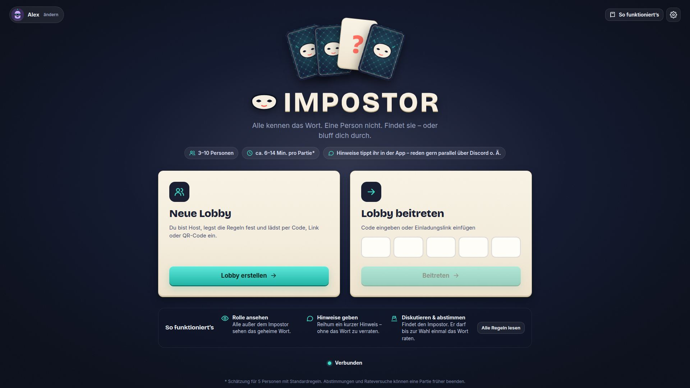
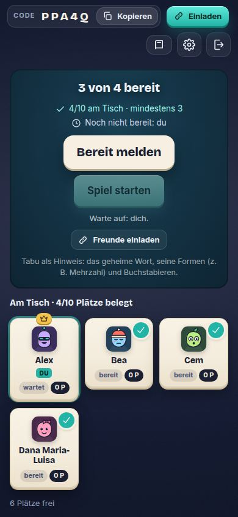
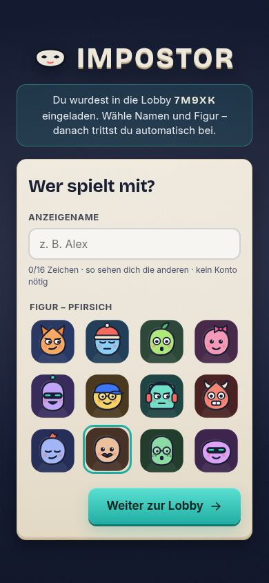

# IMPOSTOR – Online-Partyspiel als digitales Kartenspiel

Alle am Tisch kennen dasselbe geheime Wort – bis auf eine Person. Reihum legt jede Person einen Hinweis als Karte auf den Tisch.
Die Eingeweihten wollen den Impostor entlarven, der Impostor blufft mit oder rät das Wort (ein Versuch, alles oder nichts).

- **Windows-App** (Electron, Fenster + Vollbild) und **derselbe Client im Browser**
- **Eigenständiger Echtzeitserver** (Node.js + WebSocket), unabhängig vom PC des Hosts
- Private Lobbys für **3–10 Personen** per 5-stelligem Code, Gastzugang mit Name + Figur, deutsche Oberfläche, 254 deutsche Begriffe

| Lobby | Rollenkarte | Hinweisrunde |
|---|---|---|
|  |  |  |
| **Geheime Wahl** | **Auflösung** | **10 Personen, 120 Hinweise** |
|  |  |  |
| **Startseite (1920 px)** | **Lobby am Handy** | **Einladung per Link (Handy)** |
|  |  |  |

Alle Screenshots entstehen automatisch durch `npm run test:ui`, `npm run test:visual` und `npm run test:multiplayer`.

## Spielserver

Windows-App und Browser-Version verbinden sich **automatisch** mit dem produktiven Server
**https://imposter-hx0a.onrender.com** (WebSocket `wss://imposter-hx0a.onrender.com/ws`). Niemand muss eine Adresse eingeben.
Die Adresse ist zentral in [`shared/server.ts`](shared/server.ts) hinterlegt. Reihenfolge der Auflösung:

1. bewusster Entwickler-Override (*Einstellungen → Erweitert*, mit „Standardserver verwenden“ jederzeit zurücksetzbar)
2. Desktop-App: Umgebungsvariable `IMPOSTOR_SERVER_URL`, sonst Build-Wert, sonst Produktionsserver
3. Browser: der Server, der die Seite ausgeliefert hat (gleicher Ursprung)

Eingaben wie `…onrender.com`, `https://…/`, `wss://…/ws` oder `…/ws/ws` werden auf dieselbe Adresse normalisiert. Ungültige,
leere oder alte gespeicherte Werte blockieren den Standard nicht; die früher gespeicherte `serverUrl` (z. B. `localhost` aus
Tests) wird bei der Migration auf Einstellungsversion 2 verworfen. Lokale Adressen werden nie stillschweigend als Fallback
verwendet. Der Render-Free-Tarif schläft nach Inaktivität ein; die App zeigt dann „Verbindung wird hergestellt … Der
Spielserver startet gerade“ und versucht es mit wachsendem Abstand (bis ca. 2 Minuten) erneut, danach „Erneut versuchen“.

---

## Schnellstart (lokal)

Voraussetzung: Node.js ≥ 20.

```bash
cd impostor
npm install
npm run build          # Web-Client, Server und Desktop-Hülle bauen
npm start              # Server + Web-Client auf http://localhost:8787
```

Dann `http://localhost:8787` in mehreren Browserfenstern öffnen. Mehrere Spieler **im selben Browser** brauchen getrennte
Sitzungen: `http://localhost:8787/?slot=2`, `?slot=3` … (oder private Fenster bzw. verschiedene Browser).

Im LAN können Freunde über `http://<deine-IP>:8787` mitspielen. Für Spiele über das Internet braucht ihr einen
erreichbaren Server – siehe [Server bereitstellen](#server-bereitstellen).

Entwicklung mit Hot-Reload: `npm run dev` (Server auf 8787 mit Neustart bei Änderungen, Vite auf http://localhost:5173).

Desktop-App lokal gegen den lokalen Server starten: `IMPOSTOR_SERVER_URL=ws://localhost:8787 npm run desktop`
(ohne die Variable verbindet sie sich mit dem Produktionsserver).

---

## Technik und Begründung

| Teil | Wahl | Warum |
|---|---|---|
| Server | Node.js 22, TypeScript, [`ws`](https://github.com/websockets/ws) 8 | Ein Prozess, ein Eventloop: jede Spielaktion wird atomar in Ankunftsreihenfolge verarbeitet – ideal für „Rateversuch vs. Timer vs. Wahlbeginn". Kein Framework-Overhead, einfach zu hosten. |
| Client | React 19, Vite 8, [Motion](https://motion.dev) 13 | Wiederverwendbare Web-Oberfläche für Browser **und** Desktop; Motion für Layout-/Karten-Animationen inkl. `reducedMotion`. |
| Desktop | Electron 44 + electron-builder 26 | Installierbare Windows-App (NSIS + portable), lädt denselben gebauten Client lokal (`file://`), Vollbild über F11. |
| Sound | Web Audio, zur Laufzeit synthetisiert | Eigene Klänge ohne Lizenzfragen, getrennte Lautstärke für Effekte und Musik. |
| Schriften | Bricolage Grotesque, Inter (SIL OFL, via Fontsource, lokal gebündelt) | Kräftige, gut lesbare Typografie ohne Internetzugriff. |
| Tests | `node:test`, echte WebSocket-Clients, Playwright (Chromium, Electron) | Regeln, Geheimhaltung und Multiplayer-Grenzen werden gegen den echten Server geprüft. |

### Verzeichnisstruktur

```
impostor/
  shared/protocol.ts       Protokoll, Begriffe, Limits, Zeiten (Client + Server)
  server/
    app.ts                 HTTP + WebSocket, Sitzungen, Idempotenz, Rate-Limits, Verteilung der Sichten
    lobby.ts               Lobby: Personen, Host, Einstellungen, Bereitschaft, Chat, Punkte
    modes/types.ts         Schnittstelle für Spielmodi (MatchController)
    modes/classic.ts       Klassischer Modus: Phasen, Züge, Timer, Abstimmungen, Rateversuch, Pause
    words.ts               254 Begriffe (8 Kategorien) mit Aliaslisten – nur serverseitig
  client/src/
    net/connection.ts      Verbindung, automatische Wiederverbindung, Wiederholung mit gleicher Aktions-ID, Uhrzeitabgleich
    screens/               Profil, Onboarding, Start, Lobby, Auflösung, Regeln, Einstellungen
    match/                 Spieltisch der Partie, Rollenkarte, Historie, Chat, Rateversuch
    ui/                    Tisch/Sitzplätze, Avatare (SVG), Kartenrückseite, Icons, Dialoge
    audio/sound.ts         Klangsynthese + zurückhaltende generative Musik
  desktop/                 Electron-Hauptprozess, Preload-Brücke, App-Icon
  test/                    Regel- und Multiplayer-Tests
  scripts/                 Build, UI-Check, Desktop-Check, Icon
```

### Autorität und Geheimhaltung

Der **Server** ist die einzige verbindliche Instanz für Rollen, Wort, Phasen, Reihenfolge, Timer, Stimmen, Rateversuche und
Sieg. Der Host ist nur ein Spieler mit Lobby-Rechten.

Nach jeder Änderung erhält **jede Person ausschließlich ihre persönliche Sicht** (`ClientView`):

- **Öffentlich** (für Teilnehmer der Partie): Sitzordnung, Hinweise, Phase, aktive Person, Fristen, Rollenbestätigungen,
  Unterstützer eines Abstimmungsvorschlags, *wer* schon gewählt hat.
- **Privat**: eigene Rolle, das Wort nur für Eingeweihte, eigene erlaubte Aktionen, eigene (noch geheime) Stimme.
- **Nur Server**: Rollenzuordnung, Wort, Wort-ID, Aliase, Stimmen bis zur Auswertung, Sitzungstoken, Zufallswerte.

Der Impostor erhält das Wort weder über Netzwerk, DOM, Client-State, Reconnect-Snapshots noch Logs (Tests prüfen die rohen
WebSocket-Frames und das DOM). Späteinsteiger während einer Partie bekommen keine Hinweise, Rollen, Wörter oder Stimmrechte.
Hinweise werden **nie** mit dem Wort verglichen; leere, zu lange und doppelte Hinweise werden für alle Rollen gleich
behandelt. Produktionslogs enthalten nur Lobbyanzahlen.

### Robustheit

- Stabile Spieler-IDs (UUID) unabhängig von Namen und Verbindungen; zufällige Gast-Sitzungstoken (192 bit). Ein Lobbycode
  allein übernimmt nie eine bestehende Identität.
- Jedes Kommando trägt eine eindeutige **Aktions-ID**; der Server merkt sich die letzten 200 Antworten je Sitzung und
  wertet Wiederholungen (Doppelklick, Netzwerk-Retry nach Reconnect) nie doppelt aus.
- Phasen: `lobby → roleReveal → clues ⇄ discussion → voting → resolution | aborted`. Nach dem ersten Ergebnis ist die Partie
  gesperrt; weitere Ergebnisse sind ausgeschlossen.
- Fristen sind Serverzeitpunkte; Clients zeigen Timer aus einem gemessenen Uhrzeitversatz (Ping mit kleinster Laufzeit).
  Animationen steuern nie den Spielzustand; ein neu verbundener Client zeigt sofort den aktuellen Zustand.
- Serverseitige Prüfung jeder Berechtigung, Typvalidierung, Längenlimits, max. 4 KB pro Nachricht, Token-Bucket pro
  Verbindung, Chat-Drossel, max. Verbindungen pro IP, max. Lobbys.
- Jede Lobby hat ihre eigene Spiellogik und ihren eigenen Timer; Sichten werden nur an ihre Mitglieder verteilt.

### Weitere Modi (vorbereitet, nicht sichtbar)

`server/modes/types.ts` definiert die Schnittstelle `MatchController` (Kommandos, Fristen, Verbindungsstatus, öffentliche
und private Sicht, Ergebnis). Die Lobby (Personen, Host, Einstellungen, Bereitschaft, Punkte, Chat) ist davon getrennt.
„Impostor zeichnet", „Andere Frage", „Impostor erzählt" und „Zwei Wörter" können als eigene Klassen mit eigenen Regeln und
Sichten ergänzt werden; `LobbySettings.mode` wählt den Modus. Es gibt bewusst keine universelle Spiel-Engine und keine
funktionslosen Modus-Kacheln in der Oberfläche.

---

## Umgesetzte Regeln (Standard)

- Genau ein Impostor, Rollen und Wort pro Partie serverseitig neu ausgelost (`crypto.randomInt`), keine vorhersehbare Rotation.
- Startperson zufällig; pro Durchgang rückt der Start um einen Platz, die Sitzordnung bleibt zyklisch.
- Durchgänge 3 / **5** / 8 / 10 / 12 („Abstimmung spätestens nach N Durchgängen"). Presets: Einsteiger (3 · 45 s),
  Standard (5 · 30 s), Lang (10 · 30 s). Der Standard wurde von 10 auf 5 gesenkt: 10 Durchgänge ergeben bei 4–6 Personen bis
  zu 20–30 Minuten Hinweisphase, Assoziationen wiederholen sich meist nach 4–5 Durchgängen. Die zuletzt als Host gewählten
  Regeln werden lokal gespeichert und beim Erstellen einer neuen Lobby übernommen.
- Zugtimer 15 / **30** / 45 / 60 s oder ohne. Diskussion 45 s, geheime Wahl 30 s, Rollenbestätigung 60 s.
- Kategorien kombinierbar, konkrete Kategorie geheim; optional gemeinsamer Kategoriehinweis für alle.
- Keine Wortwiederholung in einer Lobby, solange der gewählte Pool reicht.
- Vorzeitige Abstimmung: einmal pro Durchgang vorschlagen, Unterstützung sichtbar und zurücknehmbar, auslösend bei
  **mehr als der Hälfte** aller Teilnehmenden; Vorschläge verfallen am Durchgangsende. Keine Mehrheit → weiter am
  unterbrochenen Zug mit gespeicherter Restzeit, im selben Durchgang kein neuer Vorschlag.
- Wahl: alle inkl. Impostor, genau eine andere Person, Auswahl und „Stimme abgeben" getrennt, keine Stimme = Enthaltung.
  Überführt bei > n/2 aller möglichen Stimmen. Schlussabstimmung ohne Mehrheit → Impostor gewinnt.
- Rateversuch nur für den Impostor in Hinweisphase und Diskussion, zweistufige Bestätigung, atomar. Normalisierung:
  Groß-/Kleinschreibung, Unicode (NFKC), äußere und innere Leerzeichen, Bindestriche/Punkte, ß→ss, ä/ö/ü→ae/oe/ue,
  Akzente. Weitere Antworten nur über die kuratierte Aliasliste – „Ball" ist nicht „Fußball".
- Lobby-Punktestand (abschaltbar): 1 Punkt je siegreicher Person, Abbrüche geben keine Punkte.
- Verbindungsabbruch: neutrale Pause mit gesicherter Restzeit, bis 60 s Rückkehr, max. 120 s pro Person und Partie, danach
  Abbruch ohne Wertung. Absichtliches Verlassen bricht ebenfalls ohne Wertung ab.
- Host-Nachfolge: am längsten anwesende verbundene Person.

### Bewusste Festlegungen / Abweichungen

- **Nach Partieende** ist die Lobby serverseitig sofort wieder offen (Phase `lobby`, Bereit-Status zurückgesetzt). Die
  Auflösung mit Dramaturgie und Ergebnisansicht zeigt jeder Client so lange, bis die Person „Noch eine Partie" (setzt
  sie bereit) oder „Zur Lobby" wählt.
- **Abbrüche decken nichts auf**: Rolle und Wort bleiben geheim, damit ein Abbruch nicht zum Ausspähen genutzt werden kann.
- **Vorzeitige Abstimmung ohne Mehrheit** zeigt allen die Stimmenzahl je Person und die Enthaltungen – ohne Zuordnung, wer
  wen gewählt hat. Die vollständige Zuordnung erscheint erst in der Auflösung.
- **Zusatz „Bereit zur Wahl"**: Sind alle einverstanden, beginnt die Wahl vor Ablauf der 45 s.
- **Chat** gibt es in der Lobby sowie während Diskussion und Wahl. In der Hinweisphase ist er gesperrt (Hinweise laufen über
  Karten, parallel gern über Discord). Der Partie-Chat verfällt mit der Partie.
- **Start** nimmt alle *verbundenen* Lobbymitglieder auf. Wer außerhalb einer Partie länger als 60 s getrennt ist, wird aus
  der Lobby entfernt. Vom Host entfernte Personen können dieser Lobby nicht erneut beitreten.
- **Einladungslink** gibt es nur im Browser-Client, wenn der Server den Web-Client ausliefert (`?lobby=CODE` tritt nach dem
  Profil automatisch bei). Die Desktop-App bietet nur „Code kopieren".
- **Privatsphäre-Modus** verdeckt die Rollenkarte (Ansehen nur bei gedrückter Taste). Die Schaltfläche „Ich kenne das Wort"
  sieht nur der Impostor – wer direkt auf seinen Bildschirm schaut, erkennt sie. Gegen Bildschirmübertragung oder
  Schummeln schützt kein Modus.
- **Schwierigkeit** ist je Wort erfasst, aber noch kein Lobby-Filter. **Eigene Wortpakete** sind nicht umgesetzt.
- **Serverneustart**: Zustand liegt nur im Speicher. Bei geordnetem Herunterfahren (SIGTERM) werden laufende Partien ohne
  Wertung beendet und alle Clients informiert; bei einem Absturz gehen Lobbys verloren und Clients melden „Der Server wurde
  neu gestartet". Eine lückenlose Wiederaufnahme ist **nicht** implementiert. Ein Serverprozess = eine Instanz (keine
  horizontale Skalierung).

---

## Tests

```bash
npm run typecheck
npm test              # 58 Regel-, Geheimhaltungs-, Konfigurations- und Multiplayer-Tests
npm run build
npm run test:ui       # Browser-Ende-zu-Ende: 4 Clients, mehrere Partien, 10er-Runde mit 120 Hinweisen, Screenshots
npm run test:visual   # Screenshots + Überlaufprüfung in 1920×1080, 1366×768, 1024×700, 390×844
xvfb-run -a npm run test:multiplayer   # Desktop-App (Electron) + 2 Browser: 3 Partien, Reconnect, Fristablauf, Hostwechsel
```

`test:ui`, `test:visual` und `test:multiplayer` nutzen Chromium über `playwright-core`; Pfad per `CHROMIUM_PATH` anpassbar.

Abgedeckt u. a.: vier unabhängige Clients per Code in derselben Lobby über mehrere Partien; genau drei gleiche Wörter und
der Impostor erhält es in keinem Frame; nur die aktive Person kann Hinweise geben; Hinweisvalidierung ohne Wortbezug;
einmaliger Rateversuch (richtig/falsch/gesperrte Phasen, Doppelklick mit gleicher Aktions-ID); vorzeitige und
Schlussabstimmung, Enthaltungen, fehlende Mehrheit, falsche Beschuldigung; geheime Stimmen; Timer-Ablauf; Pause,
Wiederverbindung mit derselben Identität, 60/120-s-Grenzen; Rateversuch vs. abgelaufene Frist; manipulierte Nachrichten,
falsche Phasen, übergroße Nachrichten, Spam; Lobby-Isolation; Späteinsteiger; Kick; Host-Nachfolge; reduzierte Bewegung;
Tastaturbeitritt; 1366 × 768 und 1920 × 1080.

---

## Windows-App bauen

**Automatisch (empfohlen):** Der Workflow `.github/workflows/release-impostor.yml` („Release Impostor (Windows-EXE)")
baut auf `windows-latest` den NSIS-Installer und die portable EXE und lädt sie als Artefakt und Pre-Release
`impostor-v<version>` hoch. Er läuft bei jedem Push auf `main` bzw. `claude/**` mit Änderungen unter `impostor/`, bei
Tags `impostor-v*` und manuell über *Actions → Release Impostor (Windows-EXE) → Run workflow* (optional mit Tag und
Serveradresse). Die eingebaute Serveradresse kommt aus diesem Eingabefeld oder der Repository-Variable
`IMPOSTOR_SERVER_URL` (*Settings → Secrets and variables → Actions → Variables*). Tests laufen separat in
`.github/workflows/impostor.yml`.

**Lokal unter Windows:**

```powershell
cd impostor
npm ci
$env:IMPOSTOR_SERVER_URL = "wss://impostor.example.com/ws"   # optional
npm run dist:win     # → release/Impostor-Setup-0.1.0.exe und release/Impostor-0.1.0-portable.exe
```

Die EXE ist nicht signiert; Windows SmartScreen kann warnen. Ohne `IMPOSTOR_SERVER_URL` enthält die EXE den
Produktionsserver als Standard. **Achtung:** Ist die Repository-Variable `IMPOSTOR_SERVER_URL` gesetzt, hat sie beim Build
Vorrang – für den Render-Server leer lassen oder auf `https://imposter-hx0a.onrender.com` setzen.

---

## Server bereitstellen

Die Desktop-App enthält **keinen** Spielserver. Für Online-Partien muss ein Server erreichbar sein. Er liefert zusätzlich
den Web-Client aus, sodass Freunde auch ohne Installation im Browser mitspielen können.

### Mit Docker (beliebiger Host: VPS, Render, Fly.io, Railway …)

```bash
cd impostor
docker build -t impostor-server .
docker run -d --restart unless-stopped -p 8787:8787 --name impostor impostor-server
```

Endpunkte: `/` Web-Client, `/ws` WebSocket, `/healthz` Healthcheck. Plattformen mit eigenem Port setzen `PORT` automatisch.
Wichtig: **nur eine Instanz** betreiben (Zustand im Speicher) und WebSockets erlauben.

### Ohne Docker

```bash
npm ci && npm run build:client && npm run build:server
PORT=8787 node dist/server/server.mjs      # z. B. als systemd-Dienst
```

### TLS (wss://) über Reverse Proxy – Beispiel Caddy

```
impostor.example.com {
    reverse_proxy 127.0.0.1:8787
}
```

Caddy besorgt das Zertifikat automatisch und reicht WebSockets durch. Hinter einem Proxy `TRUST_PROXY=1` setzen, damit das
Verbindungslimit pro IP die echte Client-IP verwendet.

| Variable | Standard | Bedeutung |
|---|---|---|
| `PORT` | `8787` | HTTP/WebSocket-Port |
| `HOST` | `0.0.0.0` | Bind-Adresse |
| `STATIC_DIR` | `dist/client` | Web-Client-Verzeichnis (leer/fehlend → nur WebSocket) |
| `TRUST_PROXY` | – | `1` = `X-Forwarded-For` auswerten |
| `MAX_CONNECTIONS_PER_IP` | `40` | gleichzeitige Verbindungen je IP |
| `MAX_LOBBIES` | `2000` | gleichzeitige Lobbys |
| `IMPOSTOR_SERVER_URL` | – | nur Build/Desktop: abweichende Serveradresse (sonst Produktionsserver) |

Es werden keine Geheimnisse benötigt oder im Repository gespeichert.

---

## Status

**Implementiert:** vollständiger klassischer Modus (Lobby, Rollenverteilung, Hinweise, vorzeitige und Schlussabstimmung,
Rateversuch, Auflösung, weitere Partien, Punktestand), Verbindungsabbrüche und Sonderfälle, Tabletop-Design mit
Animationen für alle zehn geforderten Momente, synthetisierte Sounds und Musik, Onboarding, Regeln, lokale Einstellungen
(Audio, Bewegung, Vollbild, Privatsphäre; Serveradresse nur unter „Erweitert“), Tastaturbedienung, Web-Client, Electron-App, Docker-Setup,
CI-Workflow.

**Hier tatsächlich getestet (alles gegen einen lokalen Server mit identischem Code):** 58 automatisierte Tests;
Browser-Ende-zu-Ende mit vier Clients und einer 10er-Runde mit 120 Hinweisen; visuelle Prüfung in vier Fenstergrößen;
Mehrspieler-Lauf mit der echten Electron-App (Linux/Xvfb) plus zwei unabhängigen Browsern (einer davon in Handy-Breite über
den Einladungslink): drei Partien, Punkte, Wiederverbindung, Ablauf der 60-s-Frist, Hostwechsel. Außerdem: frisches
Electron-Profil und Migration alter `localhost`-Einstellungen führen zum Produktionsserver.

**Nicht erledigt / nicht verifiziert:**

- Der Render-Server war aus der Entwicklungsumgebung nicht erreichbar (Netzwerkrichtlinie). Die echte Verbindung zu
  `wss://imposter-hx0a.onrender.com/ws` ist daher nicht getestet – nur, dass alle Clients genau diese Adresse verwenden.
- Die App wurde nicht auf einem echten Windows-Rechner gestartet; getestet wurde dieselbe Electron-App unter Linux.
- Das Docker-Image selbst wurde hier nicht gebaut (die Build-Schritte ja); auf Render läuft es bereits.
- Keine Code-Signatur, keine eigenen Wortpakete, keine Wiederaufnahme nach Serverabsturz, keine horizontale Skalierung.
