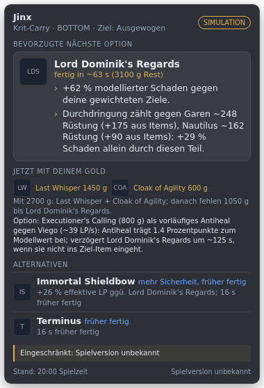

# LoL Build-Assistent

Windows-Desktop-App mit dezentem Ingame-Overlay. Sie erkennt deinen Champion und die Teams und schlägt die **nächste** sinnvolle Kaufentscheidung vor: bevorzugte Option, bis zu zwei Alternativen, passende Komponenten fürs aktuelle Budget und jeweils einen berechneten Grund. Beobachtete gegnerische Käufe fließen direkt in die Bewertung ein. Wenn sich der Vorschlag ändert, zeigt das Overlay, welche Beobachtung dafür verantwortlich war.

Die App **berät nur**. Sie kauft nichts, steuert nichts und liest ausschließlich die dokumentierte lokale Live Client Data API. Es gibt kein Memory Reading, keine Injection und keinen Eingriff in Vanguard. Garantierte Siege oder eine „perfekte“ Optimierung verspricht sie nicht.



- Machbarkeit, Datenverfügbarkeitsmatrix, Riot-Regeln, offene Freigaben: [`docs/FEASIBILITY.md`](docs/FEASIBILITY.md)
- Wie die Engine rechnet (Formeln, Gewichte, Heuristiken, Hysterese): [`docs/ENGINE.md`](docs/ENGINE.md)
- Was funktioniert, was nur modelliert ist, was fehlt und was fachlich ungeprüft ist: [`docs/STATUS.md`](docs/STATUS.md)

## Stack und Begründung

**Electron + TypeScript.** Der Hauptprozess (Node) liest die lokale HTTPS-API auf Port 2999. Ein transparentes, randloses Fenster mit `alwaysOnTop('screen-saver')` und `setIgnoreMouseEvents` wird zum klickdurchlässigen Overlay, globale Hotkeys laufen über `globalShortcut`. Engine, Adapter, UI und Tests teilen eine Sprache, und die Engine läuft ohne Electron (CLI-Demo, Tests). Die Alternative wäre C#/WPF: nativer und etwas leichter, aber Engine und Tests wären dann nicht plattformunabhängig ausführbar gewesen. Das Overlay ist ein normales Fenster. Deshalb muss **League im randlosen Fenstermodus** laufen; im exklusiven Vollbild wird kein Overlay angezeigt.

## Starten

Voraussetzungen: Node.js ≥ 20, Windows 10/11 für den Live-Betrieb. Simulation und Tests laufen auch unter Linux und macOS.

```bash
cd lol-build-assistant
npm install
npm start            # Live-Modus: wartet auf eine laufende Partie
npm run start:sim    # direkt im getrennten Simulationsmodus
npm run demo -- jinx-armor-stack --details   # Partie-Simulation im Terminal
npm test             # 51 Tests: fachliche Szenarien, Adapter, Patch-Sync
npm run typecheck
npm run dist:win     # Windows-Installer/Portable (electron-builder) → release/
```

### Release (GitHub Actions)

Der Workflow `.github/workflows/release-lol-build-assistant.yml` baut auf `windows-latest` den Installer und die portable EXE, führt vorher Typprüfung und Tests aus und veröffentlicht beides als GitHub-Release (Vorabversion). Auslöser ist ein Tag `lol-v<version>`, z. B. `git tag lol-v0.1.0 && git push origin lol-v0.1.0`, oder „Run workflow“ mit Tag-Eingabe. Die EXE ist nicht signiert, deshalb kann Windows SmartScreen warnen.

### Bedienung

| Hotkey | Wirkung |
|---|---|
| Strg+Umschalt+O | Overlay ein/aus |
| Strg+Umschalt+E | Overlay auf-/zuklappen (Build-Pfad, Gegnerkäufe, Vergleich, „Warum geändert?“, „Warum nicht …?“, Datenqualität) |
| Strg+Umschalt+L | Overlay bedienbar machen (verschieben, scrollen); erneut drücken = wieder klickdurchlässig |
| Strg+Umschalt+↑ / ↓ | Größe |
| Strg+Umschalt+K | Steuerfenster öffnen |

Im **Steuerfenster** stellst du Folgendes ein bzw. siehst es: Rolle, Spielweise (wechselt nie automatisch), Zielfokus (Frontline/Backline/ausgewogen), Quelle für gegnerische Items, Fixierung eines Items, Spielversion, Wechselschwellen und den strikten Patchmodus. Dort trägst du auch gegnerische Items ein, steuerst die Simulation, liest den Änderungsverlauf und die Datenverfügbarkeit, die zur Laufzeit geprüft wird.

**Gegnerische Items:** Standardmäßig trägst du sie **manuell** ein. Ob die API nur zeigt, was du im Spiel sehen kannst, ist nicht nachgewiesen (siehe `docs/FEASIBILITY.md`). Die API-Werte stehen daneben als „nicht verwendet“ und lassen sich nach eigener Kontrolle übernehmen.

**TLS:** Der Spielclient nutzt ein selbstsigniertes Zertifikat. Legst du Riots `riotgames.pem` ab und trägst den Pfad in `settings.json → riotCaFile` ein, wird dagegen geprüft. Ohne die Datei wird die Prüfung **nur für 127.0.0.1** gelockert.

**Spielversion:** Die Live Client Data API liefert sie nicht. Du kannst sie im Steuerfenster eintragen, z. B. `26.19`, oder `useLcuForVersion` aktivieren (inoffizielle LCU, gekapselt). Ohne Version bleiben Empfehlungen sichtbar „eingeschränkt“.

## Projektstruktur

```
data/patches/<id>/        versionierte Patch-Datensätze (manifest, items, champion-stats, optional names.de_DE)
data/rules/               Kampfregeln (Durchdringungsreihenfolge, CC-Regeln, Krit …)
data/champions/knowledge  grobes Wissen über alle häufigen Champions (Gegner/Mitspieler)
data/champions/profiles/  detaillierte, versionierte Profile der unterstützten Champions
data/sim/                 Simulationsszenarien mit Zeitleiste
src/data/                 Live-Adapter, Normalisierung, Inventar-Tracker, Poller, LCU-Version (optional)
src/patch/                Laden/Validieren der Datensätze, Versionsabgleich
src/engine/               Empfehlungsengine (siehe docs/ENGINE.md)
src/present/              View-Model fürs Overlay
src/main/, src/renderer/  Electron-Hauptprozess, Overlay und Steuerfenster
scripts/patch-sync.ts     Data-Dragon-Sync mit Abweichungsbericht
test/                     Szenario- und Unit-Tests, versionierte Eingaben in test/scenarios
```

## Patchdaten pflegen

1. `npm run patch:sync -- 26.19` legt `data/patches/26.19/` an. Das Skript übernimmt aus Data Dragon Preise, Rezepte, Grundwerte, deutsche Namen und Championbasiswerte und schreibt dazu `SYNC-REPORT.md`. Offline geht es auch: `--from-dir <ordner mit item.json, champion.json>`.
2. Durchdringung, Lethalität, Fähigkeitstempo und Effekte stehen in Data Dragon nur im Tooltip-Text. Sie werden **nicht automatisch** übernommen. Prüfe die Liste „Manuell prüfen“ im Bericht und korrigiere `items.json`.
3. Neue, unkuratierte Items fließen nur mit ihren Grundwerten in Gegnerschätzungen ein (Tag `unkuratiert`) und werden nie vorgeschlagen. Um eins vorzuschlagen, gibst du ihm passende Tags, Gruppen und Effekte und setzt `coverage`.
4. Erst nach fachlicher Prüfung trägst du die Version in `manifest.json → validatedGameVersions` ein. Vorher bleibt die Anzeige „eingeschränkt“.

Die App wählt automatisch den Datensatz, der zur Spielversion (major.minor) passt. Gibt es keinen, nutzt sie **sichtbar eingeschränkt** die kuratierte Basis und verwendet nie stillschweigend eine andere Version.

## Champion hinzufügen

1. `data/champions/profiles/<Key>.json` anlegen. `Key` ist der interne Name aus `rawChampionName`, z. B. `MonkeyKing`. Vorlage ist ein bestehendes Profil. Es braucht:
   - Basiswerte, Fähigkeiten (Grundschaden je Rang, Ratios, Abklingzeiten, Schadensart), Skillreihenfolge;
   - `coverage.modeled` und `coverage.unmodeled`, und zwar ehrlich;
   - eine oder mehrere **Spielweisen** mit Kriteriengewichten, Itemklassen (`itemTags`), Extras und Ausschlüssen, Zielzugriff (Front-/Backline), Manabedarf und **Szenarien** (Dauer, Uptime, Einsätze, fehlendes Leben).
2. `supportLevel`: `supported` nur, wenn die wesentlichen Schadensquellen modelliert sind, sonst `partial`. Das wird in der UI angezeigt.
3. Falls nötig, einen Eintrag in `data/champions/knowledge.json` für die Einschätzung als Gegner ergänzen.
4. Szenario-Tests in `test/scenarios.test.ts` ergänzen, mit fachlich begründeten Richtungen und nicht als Nachrechnung.

Die Engine ist championunabhängig. Neue Mechaniken kommen als neuer Effekttyp (`ItemEffect`) oder als Profilfeld hinzu, nicht als Sonderfall im Code.
