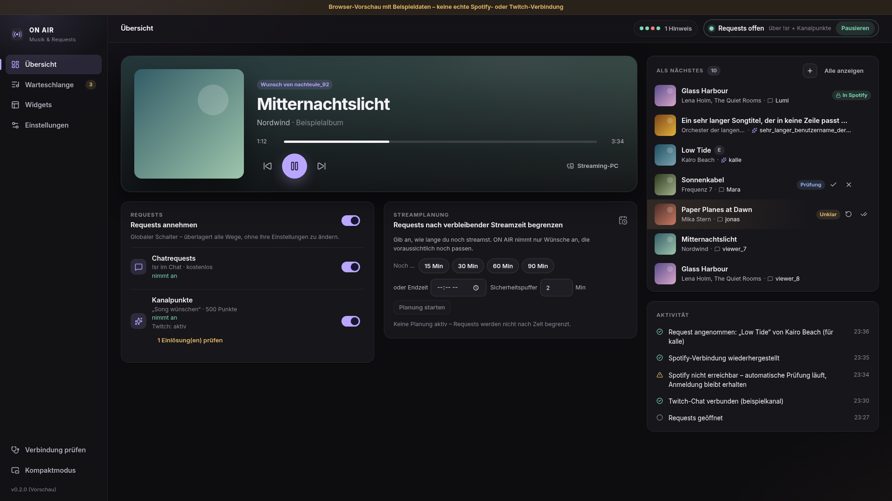

# ON AIR

Windows-Desktop-App für Streamer: **Now Playing aus Spotify, Songrequests aus dem
Twitch-Chat und OBS-Widgets** – ruhig gestaltet und auf stundenlangen Hintergrundbetrieb
mit wackeligem Netz ausgelegt. Funktional orientiert an [Songify](https://songify.rocks/features),
aber eine eigenständige Implementierung (kein übernommener Code, keine fremden App-IDs).

> Status: Version 0.2 für den eigenen Rechner. Kern und UI sind vollständig implementiert
> und gegen Fake-Provider getestet. **Noch nicht mit echten Konten live getestet**, kein
> Dauertest durchgeführt – siehe [Einschränkungen](docs/EINSCHRAENKUNGEN.md).

## Ansicht



Weitere Ansichten (Browser-Vorschau mit Beispieldaten): [docs/screenshots](docs/screenshots/).

## Funktionen

- Spotify-Anmeldung per PKCE im Systembrowser, Tokens im Windows Credential Manager
- Robuste Verbindung: Single-Flight-Refresh, getrennte Zustände für Anmeldung/Erreichbarkeit/Gerät,
  `Retry-After`, Backoff mit Zufallsanteil, Circuit Breaker, Standby-Erkennung, Abgleich statt Blind-Wiederholung
- Eigene, dauerhafte Request-Warteschlange (SQLite) mit Moderation, fairer Reihenfolge,
  Limits, Cooldowns, Sperrlisten, Explicit-Filter und sparsamer Übergabe an Spotify
- Twitch-Chatbefehle `!sr`, `!song`, `!queue`, `!remove`, `!skip`, `!voteskip` (konfigurierbar)
- Optional **Kanalpunkte-Requests** über eine eigene, von ON AIR verwaltete Belohnung –
  Erfüllen erst nach beobachtetem Start, Ablehnen erstattet die Punkte
- **Streamplanung**: Requests nur annehmen, solange sie vor dem Streamende noch passen
- **Immersiver Installer** (`ON-AIR-Setup_<version>.exe`) im ON-AIR-Design
- **Automatische Updates ohne Einrichtung** – jeder Push erzeugt ein Release; die App installiert nur in einem ruhigen
  Moment (nie während eines Livestreams), mit Countdown und „Nicht jetzt“
- OBS-Widgets *Minimal*, *Glass*, *Queue* mit Live-Vorschau, plus Now-Playing-Textdatei
- Tray-Betrieb, optionaler Autostart, Kompaktmodus für den zweiten Monitor, Stream-Profile,
  Verlauf mit erneutem Anfragen, Diagnose und anonymisierter Diagnosebericht
- Dunkel/Hell/System, Deutsch (Englisch vorbereitet), Tastaturbedienung, reduzierte Bewegung

## Schnellstart (Entwicklung)

Voraussetzungen: Node.js 22, Rust (stable), unter Windows WebView2 (in Windows 11 enthalten)
und die [Tauri-Voraussetzungen](https://v2.tauri.app/start/prerequisites/).

```bash
cd on-air
npm ci
npx tauri dev          # Desktop-App mit Hot Reload
npm run dev            # nur UI im Browser – mit markiertem Beispiel-Backend
```

Windows-Installer (NSIS `.exe` und `.msi`):

```bash
npx tauri build        # Ergebnis: target/release/bundle/{nsis,msi}/
```

Der Workflow [`.github/workflows/on-air.yml`](../.github/workflows/on-air.yml) baut den
Installer auf `windows-latest` und lädt ihn als Artefakt `on-air-windows-installer` hoch.

## Tests

```bash
cargo test -p onair-core   # 66 Rust-Tests inkl. Abnahmekriterien (simuliert)
npm run typecheck
npx playwright test        # 42 UI-Tests (Layout, Zustände, Bedienung)
```

Details und Abdeckung: [docs/TESTS.md](docs/TESTS.md)

## Aufbau

```
on-air/
  crates/onair-core/   Kernlogik ohne UI: auth, spotify, twitch, queue, storage, overlay, runtime
  src-tauri/           Desktop-Hülle: Tray, Fenster, Autostart, Credential Store, Logs
  src/                 React + TypeScript (Views, Komponenten, i18n, Designsystem)
  tests-ui/            Playwright-Layouttests
  docs/                Funktionsmatrix, Architektur, Einrichtung, Tests, Einschränkungen
```

- [Funktionsmatrix (APIs, Berechtigungen, Einschränkungen)](docs/FUNKTIONSMATRIX.md)
- [Architektur und Fehlerbehandlung](docs/ARCHITEKTUR.md)
- [Einrichtung Spotify, Twitch, OBS](docs/EINRICHTUNG.md)
- [Updates und Releases](docs/UPDATES.md)
- [Änderungen](CHANGELOG.md)

## Datenschutz

Tokens liegen ausschließlich im Windows Credential Manager. Logs enthalten keine Tokens,
Authorization-Header oder Callback-URLs. Der Overlay-Server ist nur unter `127.0.0.1`
erreichbar und liefert ausschließlich Anzeige-Metadaten. Exportierte Einstellungen enthalten
keine Zugangsdaten; der Diagnosebericht pseudonymisiert Namen und wird vor dem Speichern angezeigt.
